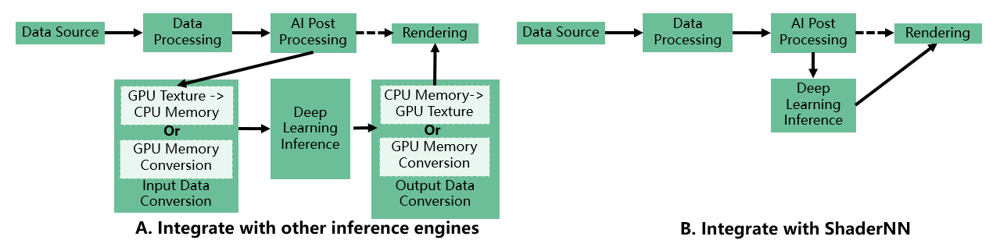

## ShaderNN 2.0 preview  release is available now!
&nbsp;

## What is ShaderNN?
 ShaderNN is a lightweight deep learning inference framework optimized for Convolutional Neural Networks. It provides high-performance inference for deep learning applications in image and graphics process on mobile devices.
 

## Innovations of ShaderNN:
- Use texture-based input/output, which provides an efficient, zero-copy integration with real-time graphics pipeline or image processing applications, thereby saving expensive data transfers & format conversion between CPU and GPU which is critical for real time application on mobile platforms.
 

- Leverage the fragment shader based on OpenGL backend in the neural network inference operators, which is advantageous when deploying parametrically small neural network modes.

- Built on native OpenGL ES and Vulkan, which can be easily integrated with the graphics rendering pipeline to maximize the use of computing resources, suits for rendering, image/video and game AI applications.

- Enable a hybrid implementation of compute and fragment shaders, with the ability to select layer-level shaders for performance optimization.

## Key features of shaderNN:
- High Performance
  - Utilize GPU Shader: Implement core operators using GPU Shader to leverage parallel computing capabilities for optimal performance.
  - Pre-built Static Computation Graph: Optimize with constant folding and operator fusion to accelerate forward operation speed.
- Lightweight & Portability & Extensibility
  - No Third-Party Library Dependencies: Ensure independence from external libraries, reducing overhead and simplifying integration.
  - Mobile Platform Optimization: Optimize specifically for mobile platforms, enabling effortless portability, deployment, and upgrades.
  - Simple Input/Output Interface: Provide a user-friendly interface compatible with GPU processing for streamlined interactions.
- Versatility
  - Framework & CNN network Compatibility: Support popular framework formats like TensorFlow, PyTorch, and ONNX. Support common classification, detection, segmentation, and enhancement networks.
  - User-Defined Operators: Enable easy implementation of new models by supporting user-defined operators.
  - Flexible backend configure: Select the running backend statically or dynamically according to the platform resources during model execution, dynamically adjusting kernel running parameters for minimal energy consumption at runtime.

## Typical Application Scenerios:
  - ShaderNN is good at graphics and image processing pipelines, and here listed some typical scenerios, such as ray tracing denoise, deep learning super sampling, high dynamic range, super resolution and style transfer etc.\
  

## Architecture:

## Getting Started:
  - Pleaes refer to [Getting-Started.md](docs/Getting-Started.md) for details.

## Model Conversion:
  - Support conversion from TensorFlow , PyTorch and ONNX based models. Please refer to [ModelConversion.md](tools/convertTool/ModelConversion.md) for details.

## Model Zoo/Examples:
  - Provide image classification, object detection, image segmentation and image enchancement models for reference. Please refer to [ModelZoo.md](modelzoo/ModelZoo.md) for details.

## Operators:
  - Implement basic CNN operators by using fragment shader, computer shader or CPU. For a complete list of operators being supported, please refer to [Operators.md](docs/Operators.md) for details.

## Benchmark:
  - Benchmark models based in Model Zoo against TFLite framework. Please refer to [Benchmark.md](benchmark/Benchmark.md) for details.

## Style Transfer Demo:
  - Style Transfer example running on Android demo app using ShaderNN framework is shown below. The [pretrained models](https://github.com/onnx/models/tree/main/vision/style_transfer/fast_neural_style/model) are inferenced to showcase styles like Candy, Mosaic, Rain Princess and Udnie.
  
    

## Branching Policy:
- For dev branches for your own use, please prefix it with "your_name/". For example, "bruce.lee/training_session_1"

## License:
- Apache License 2.0

## Acknowledgement:
ShaderNN makes use of the following third party libraries:
- [ncnn](https://github.com/Tencent/ncnn)
- [MNN](https://github.com/alibaba/MNN)
- [opencv](https://github.com/opencv/opencv)
- [libyuv](https://chromium.googlesource.com/libyuv/libyuv)
- [libjpeg](https://github.com/libjpeg-turbo/libjpeg-turbo)
- [cli11](https://github.com/CLIUtils/CLI11)
- [cmrc](https://github.com/vector-of-bool/cmrc)
- [eigen](https://gitlab.com/libeigen/eigen)
- [glad](https://github.com/Dav1dde/glad)
- [glfw](https://github.com/glfw/glfw)
- [glm](https://github.com/g-truc/glm)
- [picojson](https://github.com/kazuho/picojson)
- [stb_image](https://github.com/nothings/stb)
- [readerwriterqueue](https://github.com/cameron314/readerwriterqueue/)
- [uVkCompute](https://github.com/google/uVkCompute)
- [volk](https://github.com/zeux/volk)

ShaderNN makes use of models trained and converted from Tensorflow, PyTorch and ONNX, and uses Netron visualizer:
- [Tensorflow](https://github.com/tensorflow/tensorflow)
- [PyTorch](https://github.com/pytorch/pytorch)
- [ONNX](https://github.com/onnx/onnx)
- [Netron](https://github.com/lutzroeder/netron)

