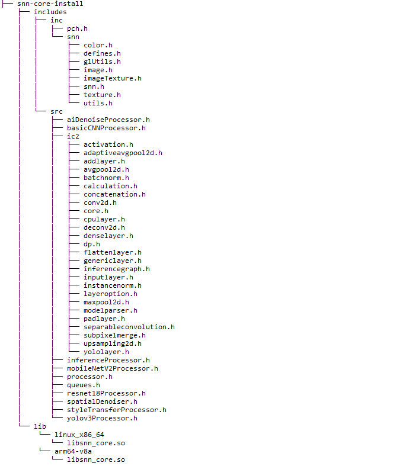

# ShaderNN core library

This folder includes source code for ShaderNN core library. By default, it will build 64 bit debug version for linux or android based on the selected build target option.

After built, it will generate snn-core-install folder including ShaderNN header files and core library:

Other apps can integrate these ShaderNNN header files and core library to do inference. 
