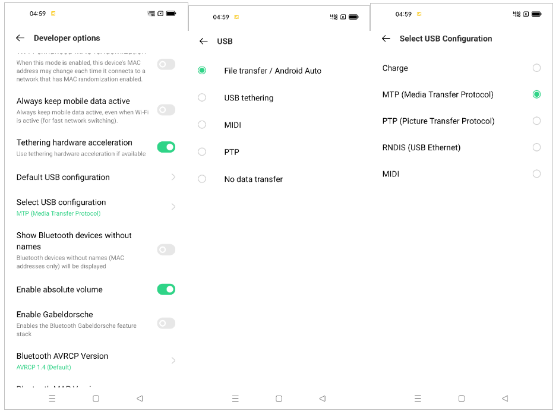
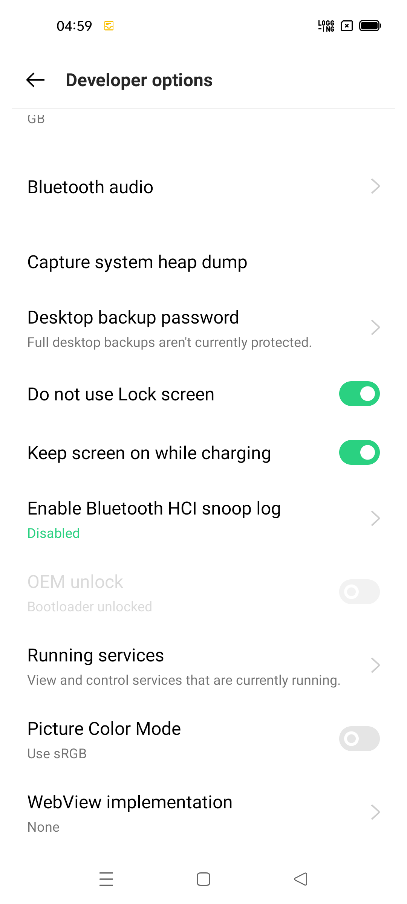

# How to benchmark models

In order to benchmark models in ShaderNN, follow these steps:
## Step 1:
- in `shaderneuralnetworkframework/core/CMakeLists.txt`, add definition for profiling: `add_definitions(-DPROFILING)`

## Step 2:
- In [native-lib.cpp](), adjust the model precsion to half precision or full precision. Inference of a model in half precision mode is expected to be faster compared to inference in full precision mode.
- In each model's testing function, the inference processor can be initialized as:

    ```ip->initlaize(modelFilename, inputList, &rc, half-precision: true/ false, false)```

## Step 3:
- Run the models via following unit tests present in [native-lib.cpp]():
  - espcn2x : Runs ESPCN 2x model
  - resnet18 : Runs ResNet 18
  - yolov3tiny : Runs YoloV3 Tiny
  - mobilenetv2 : Runs MobileNetV2

- Refer to the guide [Load-and-run-model.md](Load-and-run-model.md) for details showcasing how to run a model.
- The output is seen on logcat, reporting mean and standard deviation. Layer wise execution time is also reported.
    ```
    2022-06-07 17:33:49.504 19913-19944/com.innopeaktech.seattle.snndemo I/SNN: =========================  GPU Inference Core Time Stats =========================
    2022-06-07 17:33:49.505 19913-19944/com.innopeaktech.seattle.snndemo I/SNN: Time returned via GPU elapsed time query:
    2022-06-07 17:33:49.505 19913-19944/com.innopeaktech.seattle.snndemo I/SNN:     IC2 Total GPU runtime           : 775.194 ms
    2022-06-07 17:33:49.505 19913-19944/com.innopeaktech.seattle.snndemo I/SNN:     ESPCN_2X.json layer [01] Conv2D : 42.1421 ms
    2022-06-07 17:33:49.505 19913-19944/com.innopeaktech.seattle.snndemo I/SNN:     ESPCN_2X.json layer [02] Conv2D : 727.376 ms
    2022-06-07 17:33:49.505 19913-19944/com.innopeaktech.seattle.snndemo I/SNN:     ESPCN_2X.json layer [03] Conv2D : 166.023 ms
    2022-06-07 17:33:49.505 19913-19944/com.innopeaktech.seattle.snndemo I/SNN: ----------------------------------------------------------------------------------
    2022-06-07 17:33:49.505 19913-19944/com.innopeaktech.seattle.snndemo I/SNN: IC2 Total CPU Runtime : 786.3ms, min = 780.8ms, max = 790.6ms
    2022-06-07 17:33:49.505 19913-19944/com.innopeaktech.seattle.snndemo I/SNN: ==================================================================================
    ...
    2022-06-07 17:33:50.299 19913-19944/com.innopeaktech.seattle.snndemo I/SNN: =========================  Final Time Stats  =========================
    2022-06-07 17:33:50.299 19913-19944/com.innopeaktech.seattle.snndemo I/SNN: ESPCN_2X.json layer [01] Conv2D
    2022-06-07 17:33:50.299 19913-19944/com.innopeaktech.seattle.snndemo I/SNN: mean: 42
    2022-06-07 17:33:50.299 19913-19944/com.innopeaktech.seattle.snndemo I/SNN: stdev: 0
    2022-06-07 17:33:50.299 19913-19944/com.innopeaktech.seattle.snndemo I/SNN: ==================================================================================
    2022-06-07 17:33:50.299 19913-19944/com.innopeaktech.seattle.snndemo I/SNN: 
    2022-06-07 17:33:50.299 19913-19944/com.innopeaktech.seattle.snndemo I/SNN: [SNNLOG] [INFO] 
    2022-06-07 17:33:50.299 19913-19944/com.innopeaktech.seattle.snndemo I/SNN: =========================  Final Time Stats  =========================
    2022-06-07 17:33:50.299 19913-19944/com.innopeaktech.seattle.snndemo I/SNN: ESPCN_2X.json layer [02] Conv2D
    2022-06-07 17:33:50.299 19913-19944/com.innopeaktech.seattle.snndemo I/SNN: mean: 724.891
    2022-06-07 17:33:50.299 19913-19944/com.innopeaktech.seattle.snndemo I/SNN: stdev: 1.5948
    2022-06-07 17:33:50.299 19913-19944/com.innopeaktech.seattle.snndemo I/SNN: ==================================================================================
    2022-06-07 17:33:50.299 19913-19944/com.innopeaktech.seattle.snndemo I/SNN: 
    2022-06-07 17:33:50.299 19913-19944/com.innopeaktech.seattle.snndemo I/SNN: [SNNLOG] [INFO] 
    2022-06-07 17:33:50.299 19913-19944/com.innopeaktech.seattle.snndemo I/SNN: =========================  Final Time Stats  =========================
    2022-06-07 17:33:50.299 19913-19944/com.innopeaktech.seattle.snndemo I/SNN: IC2 Total GPU runtime
    2022-06-07 17:33:50.299 19913-19944/com.innopeaktech.seattle.snndemo I/SNN: mean: 775.862
    2022-06-07 17:33:50.299 19913-19944/com.innopeaktech.seattle.snndemo I/SNN: stdev: 1.76668
    2022-06-07 17:33:50.299 19913-19944/com.innopeaktech.seattle.snndemo I/SNN: ==================================================================================
    ```

## Step 4: 
- Running profiling on Oppo Reno 7, requires a special setup.  


    Make sure:
    - `USB debugging` is `on`
    - Default USB configuration is `File Transfer` 
    - USB configuration is `MTP`
    - Set `Do not use Lock screen` and `Keep screen on while charging` to "enabled" in `Developer options`.
