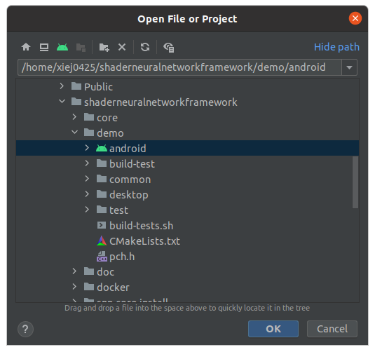
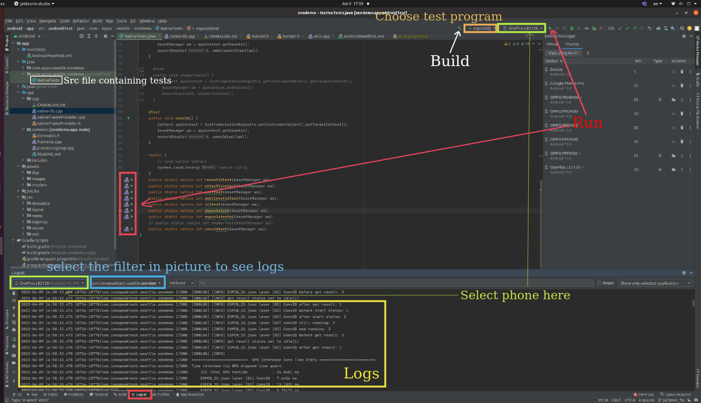
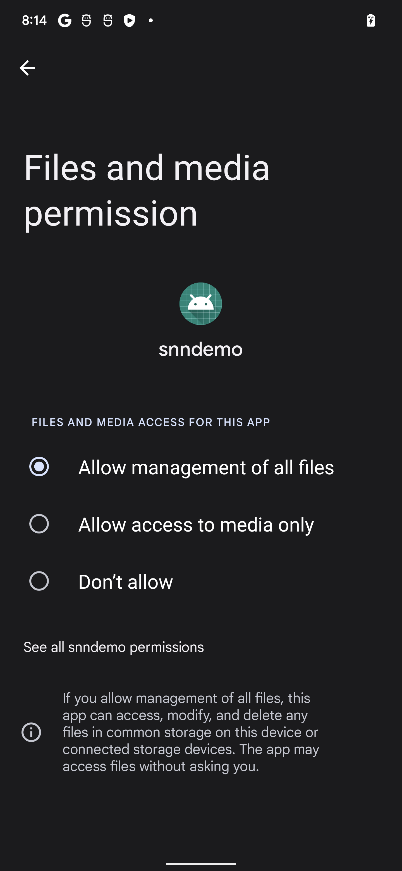

# How to load and run a model


## 1. Build the ShaderNN Core
  - Refer to [Getting-Started.md](../../docs/Getting-Started.md) for detailed build instructions to build for android target.
  - After successfully building, you should be able to locate the library and headers in `snn-core-install` folder. For 64 bit target, the library path should be `snn-core-install/lib/arm64-v8a/libsnn_core.so` and header files path should be `snn-core-install/includes`

## 2. Convert & push the model
  - Convert the model to `.json` format using the [Convert-Tool-Guide.md]()
  - Make a dir on phone (only for first setup) and push the model to phone:

    ```adb shell mkdir /data/local/tmp/jsonModel```

    ```adb push your-converted-model.json /data/local/tmp/jsonModel```

## 3. Run the model
  - If model has any layer which is not in [Supported-Operators-List.md]() and/ or if model is not in [Supported-Model-Architectures-List.md]():
    - Follow the guide [Implement-Model-Processor.md]() to implement model processor for the selected model architecture in ShaderNN core.
  - If model is in [Supported-Model-Architectures-List.md](), follow these steps:
    - Open the folder `shaderneuralnetworkframework/demo/android` in Android Studio.
    

    - Once the gradle sync is complete, locate the supported model's unit-test in [NativeTests.java](../../demo/android/app/src/androidTest/java/com/oppo/seattle/snndemo/NativeTests.java)
    - Run the test for selected model. In order to change the test settings/ parameters (model name, input asset name etc.), find the implementation of test in [native-lib.cpp](../../demo/android/app/src/main/cpp/native-lib.cpp)
    
    - Monitor logcat to see the logs generated to check run status:
      ``` adb logcat -c && adb logcat | grep SNN```

## 4. Phone specific settings
  - For phones which are not root, json file read path needs to be changed from `/data/local/tmp` to `/storage/emulated/0/` in [utils.cpp](../../core/src/utils.cpp) function name: `snn::loadJsonFromStorage(const char * assetName)`, var name `path`.
  - For Android 12, we need to update user permission in [AndroidManifest.xml](../../demo/android/app/src/main/AndroidManifest.xml) as follows:
    ```
    <uses-permission android:name="android.permission.MANAGE_EXTERNAL_STORAGE"/>
    ```
    and the app permission after installation: 
    
    