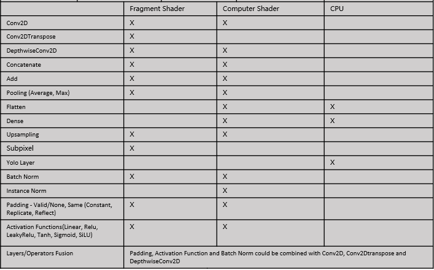

## Operators

ShaderNN implements basic CNN operators by using fragment shader, computer shader and CPU. Some operators are fused into single layer for better performance, for example, Conv2D, BatchNorm and Activation Functions. Below is the list of operators being supported:

